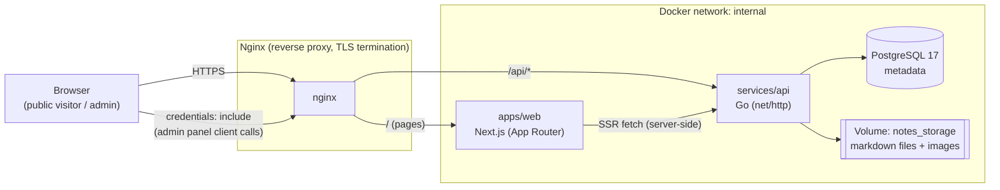
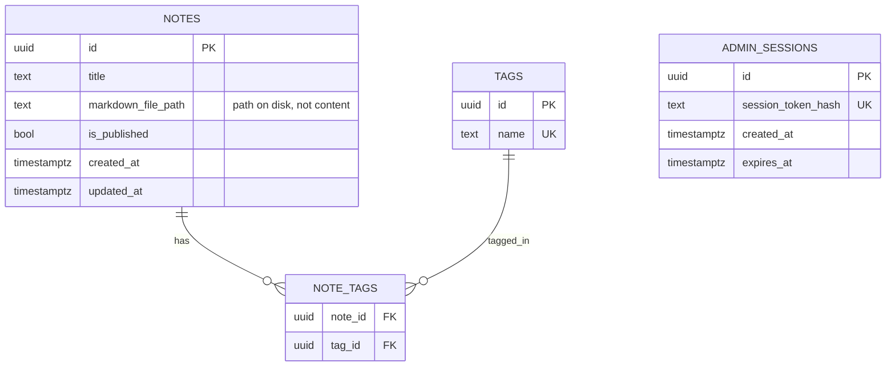
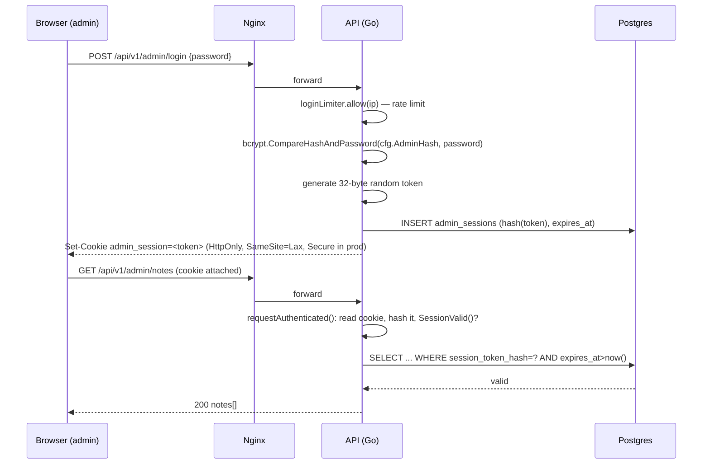
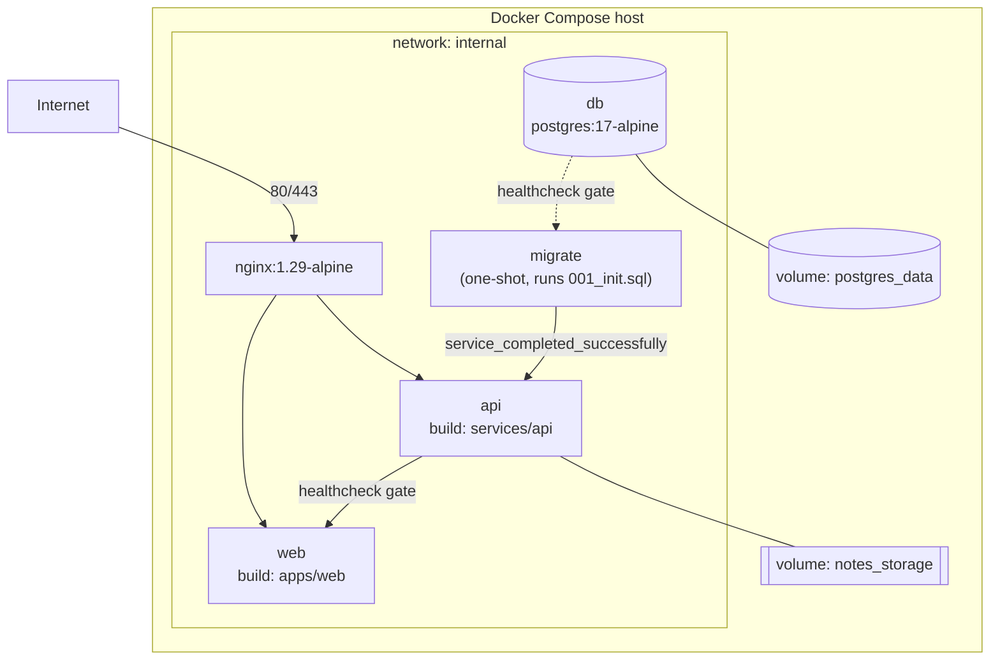

# System Design — Markdown Notes App

A full-stack markdown notes/blog application: public visitors read published notes, a single admin manages content through an admin panel. Built as a learning project for full-stack + DevSecOps practices (Next.js, Go, PostgreSQL, Docker, Nginx, HTTPS).

This document gives the end-to-end picture. For exhaustive detail on any one slice, see the companion docs in this folder: `srd-v1.md` (requirements), `api-contract-v1.md` (full endpoint spec), `db-design-v1.md` (schema rationale), `threat-model-v1.md` (security analysis), `development-setup-v1.md` (local dev).

## 1. High-level architecture

Two applications behind a reverse proxy, one database, one shared filesystem volume for note content.



**Why the split matters:**
- `notes` content lives twice, deliberately: **metadata** (title, published flag, tags, timestamps) in Postgres for querying/filtering; **body content** as raw `.md` files on disk (path referenced by `notes.markdown_file_path`). Images uploaded into a note live alongside it on disk under `<storage>/<note_id>/images/`.
- The Next.js app is a thin presentation layer — it has no direct DB or filesystem access. Every read/write goes through the Go API. Public pages fetch server-side (SSR, revalidated every 30s); the admin panel fetches client-side with cookies.
- Nginx is the only internet-facing component; `web` and `api` sit on an internal Docker network and are not published.

## 2. Components

| Component | Tech | Responsibility |
|---|---|---|
| `apps/web` | Next.js 15 (App Router, TS) | Public note listing/reading pages (SSR), admin panel (login, CRUD, markdown editor, image upload) |
| `services/api` | Go, stdlib `net/http`, `pgx` | REST API: auth, notes CRUD, tags, asset upload/serving, health checks |
| PostgreSQL | Postgres 17 | Note metadata, tags, tag associations, admin session tokens |
| Storage volume | Docker named volume | Markdown files and note images, written atomically by the API |
| Nginx | nginx:1.29-alpine | TLS termination (prod), reverse proxy to `web` and `api` |

### apps/web layout
- `app/page.tsx` — public note list (SSR, optional `?tag=` filter), `loadData()` fetches notes + tags server-side.
- `app/notes/[id]/page.tsx` — single published note, renders markdown via `components/markdown.tsx`.
- `app/admin/page.tsx` — admin dashboard: login form, note list with delete/import, calls `lib/api.ts:request()` (client-side, `credentials: "include"`).
- `app/admin/notes/new` and `app/admin/notes/[id]` — wrap `components/note-editor.tsx`, which handles save (create/update) and image upload.
- `lib/api.ts` — two fetch paths: `serverApi()` for server components hitting the API over the internal Docker network, `request()` for browser-side calls through Nginx with cookies attached.

### services/api layout
- `cmd/server/main.go` — process entrypoint, wires `Config` → `Store` → `Server`.
- `cmd/hashpassword/main.go` — CLI to bcrypt-hash the admin password for `ADMIN_PASSWORD_HASH`.
- `internal/config.go` — env-driven `Config` (DB URL, admin hash, storage dir, CORS origin, cookie flags, size limits).
- `internal/store.go` — all SQL (pgx), one `Store` per process, connection pool.
- `internal/server.go` — route table, middleware, handlers, validation. This file is the bulk of the backend logic (see §4).
- `internal/model.go` — `Note`, `Tag`, `NoteInput` DTOs.

## 3. Data model



Notable choices:
- `admin_sessions` is unrelated to any user table — there is exactly one admin, authenticated by a single bcrypt hash from config, not a DB row. Sessions exist only to track issued tokens for revocation/expiry.
- Only the **token hash** (`hashToken`, SHA-256) is stored, never the raw session token — the raw token lives only in the client's `HttpOnly` cookie.
- `note_tags` cascades on delete both ways, so deleting a note or a tag cleans up associations automatically.
- Markdown content is intentionally kept out of Postgres; `Server.getNote` reads metadata from the DB then reads the file from `safeMarkdownPath()` and stitches them into the response.

## 4. Request lifecycle

### 4.1 Routing and middleware (`internal/server.go:NewServer`)

All routes are registered on one `http.ServeMux` (Go 1.22+ method+pattern routing) and wrapped in a single `middleware()`:
- Sets `X-Content-Type-Options: nosniff`, `Cache-Control: no-store`.
- CORS: only `Access-Control-Allow-Origin` matching `cfg.AllowedOrigin` is echoed back; other origins get `403` on `OPTIONS` preflight, and state-changing (`non-GET`) admin requests from a mismatched `Origin` header are rejected outright (defense-in-depth against CSRF, since the session cookie is `SameSite=Lax`).
- Logs method/path/status/duration for every request.

Admin routes (`/api/v1/admin/*`, except login) are additionally wrapped in `s.auth()`, which requires a valid, unexpired session cookie.

### 4.2 Auth flow



Failed logins are rate-limited per IP (`loginLimiter`, in-memory sliding window) and logged via `slog.Warn`. There's no username — the app has exactly one admin identity, distinguished only by knowing the password.

### 4.3 Reading a note (public)

`GET /notes/[id]` (Next.js server component) → `serverApi()` hits `GET /api/v1/notes/{id}` on the internal network → `Server.getNote(publishedOnly=true)` → `Store.GetNote` (SQL, filtered to `is_published=true`) → on success, API reads the markdown file at `safeMarkdownPath(id, path)` off disk and merges it into the JSON response → Next.js renders it with `revalidate: 30`. Unpublished or non-existent notes surface as `404`/`400`, which the page maps to Next's `not-found`.

### 4.4 Writing a note (admin)

`note-editor.tsx:save()` → `PUT/POST /api/v1/admin/notes[/​{id}]` (cookie-authenticated, `credentials: "include"`) → `auth()` middleware validates the session → `validateNote()` checks title length, markdown size against `MAX_MARKDOWN_BYTES`, and tag shape → `Store.CreateNote`/`UpdateNote` runs inside a transaction that also calls `setTags()` to reconcile the `note_tags` join rows → the markdown body itself is written to disk via `writeAtomic()` (write to temp file, `fsync`, rename — avoids partial writes if the process crashes mid-write).

### 4.5 Assets (images)

Images are uploaded per-note (`POST /admin/notes/{id}/assets`), validated by both filename extension and sniffed MIME type (`mimeMatches`, using `http.DetectContentType`) before being written to `<storage>/<id>/images/<filename>`. Serving (`GET /notes/{id}/assets/{filename}`) checks the parent note is published — or, if unpublished, that the requester is an authenticated admin — before streaming the file with a 1-day cache header.

### 4.6 Markdown import

`POST /admin/notes/import` accepts a multipart file upload, derives a title from the filename if none is given, and otherwise reuses the same `createNoteFromInput()` path as manual note creation — so imported notes get identical validation and storage handling.

## 5. API surface (summary)

Full request/response shapes are in `api-contract-v1.md`. Shape of the surface:

| Area | Endpoints | Auth |
|---|---|---|
| Health | `GET /healthz`, `GET /readyz` | none |
| Public read | `GET /notes`, `GET /notes/{id}`, `GET /notes/{id}/assets/{filename}`, `GET /tags` | none |
| Admin auth | `POST /admin/login`, `POST /admin/logout`, `GET /admin/me` | session cookie (except login) |
| Admin notes | `GET/POST /admin/notes`, `GET/PUT/DELETE /admin/notes/{id}`, `POST /admin/notes/import` | session cookie |
| Admin assets | `POST /admin/notes/{id}/assets`, `DELETE /admin/notes/{id}/assets/{filename}` | session cookie |

All responses follow one envelope: `{ "data": ... }` on success, `{ "error": { "code", "message" } }` on failure (see `writeData`/`writeError` in `server.go`).

## 6. Security posture (summary)

Full analysis in `threat-model-v1.md`. Mechanisms visible directly in the code:

- **Auth**: bcrypt password hash (never stored in DB — it's an env var), random opaque session tokens, only token *hashes* persisted, `HttpOnly`/`SameSite=Lax`/`Secure`(prod) cookies.
- **CSRF**: `SameSite=Lax` plus an explicit `Origin` allowlist check on all non-GET admin requests.
- **Rate limiting**: login attempts throttled per source IP.
- **Input validation**: title length, tag charset/length, markdown size caps, image size caps, filename allowlists, MIME sniffing on uploaded images (not just trusting the extension/`Content-Type` header), UUID validation on every path parameter that hits the DB or filesystem.
- **Path safety**: `safeMarkdownPath` / asset paths are built from validated UUIDs and filenames, not raw user-controlled paths, to prevent traversal.
- **Atomic writes**: markdown files are written via temp-file-then-rename, avoiding corruption on crash.

## 7. Deployment topology



`compose.yaml` defines the base stack (dev-friendly defaults: `COOKIE_SECURE=false`, plain HTTP on `:8080`). `compose.prod.yaml` overlays production settings: `COOKIE_SECURE=true`, `ALLOWED_ORIGIN=https://$DOMAIN`, Nginx bound to 80/443 with a Let's Encrypt-backed TLS config. Startup order is enforced through Compose health/completion gates: `db` → `migrate` → `api` → `web`, with `nginx` depending on both `web` and `api`.

Configuration is entirely environment-variable driven (`internal/config.go`), see `.env.example` for the full list — key ones: `DATABASE_URL`, `ADMIN_PASSWORD_HASH` (generated via `cmd/hashpassword`), `STORAGE_DIR`, `ALLOWED_ORIGIN`, `SESSION_TTL`, `MAX_MARKDOWN_BYTES`, `MAX_IMAGE_BYTES`.

## 8. Project structure

```
apps/web/           Next.js frontend (public site + admin panel)
services/api/        Go backend
  cmd/server/         process entrypoint
  cmd/hashpassword/    admin password hashing CLI
  internal/           config, store (SQL), server (HTTP), models
  migrations/          SQL schema migrations
infra/nginx/          nginx.conf (dev) / nginx.prod.conf (TLS, templated)
scripts/backup.sh     operational backup script
docs/                 this file + requirements/architecture/security docs
compose.yaml / compose.prod.yaml   deployment definitions
```
